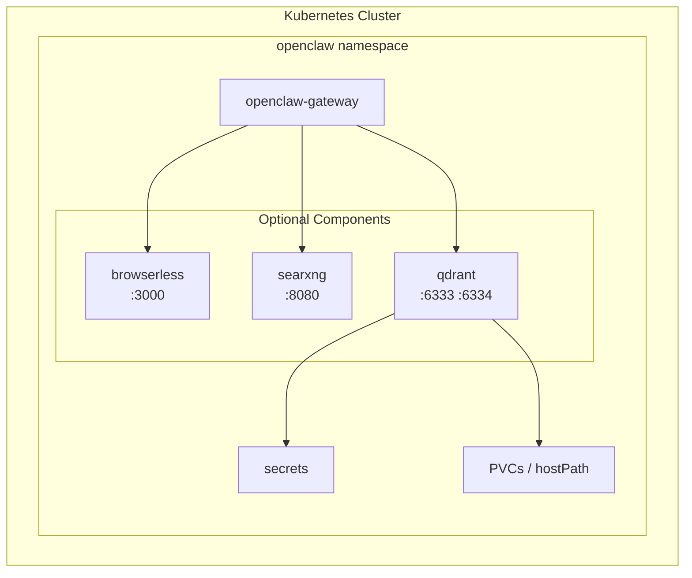

# Plan: Add Qdrant as Optional Component

## Overview

Add Qdrant vector database as an optional component to the OpenClaw Kubernetes deployment, following the established patterns used by browserless and searxng components.

## Qdrant Configuration Summary

Based on Qdrant documentation and user requirements:

| Setting | Value |
|---------|-------|
| Docker Image | `docker.io/qdrant/qdrant:latest` |
| HTTP API Port | 6333 |
| gRPC Port | 6334 |
| API Key | Auto-generated (optional, configurable) |
| Config Storage Size | 100Mi default |
| Data Storage Size | 5Gi default |
| Config Path | `/qdrant/config` |
| Storage Path | `/qdrant/storage` |

## Architecture Diagram



## Files to Create/Modify

### 1. New Files: Kubernetes Manifests

Create `manifests/qdrant/` directory with:

#### [`manifests/qdrant/deployment.yaml`](manifests/qdrant/deployment.yaml)
- Deployment named `openclaw-qdrant`
- Container with qdrant/qdrant image
- Environment variable for API key from secret
- Two container ports: 6333 (HTTP), 6334 (gRPC)
- Volume mount for storage at `/qdrant/storage`
- Node selector: `openclaw-enabled: "true"`

#### [`manifests/qdrant/service.yaml`](manifests/qdrant/service.yaml)
- Service named `openclaw-qdrant`
- ClusterIP type
- Two ports: 6333 (http), 6334 (grpc)

#### [`manifests/qdrant/pvc.yaml`](manifests/qdrant/pvc.yaml)
- PVC named `openclaw-qdrant-config-pvc` - 100Mi
- PVC named `openclaw-qdrant-storage-pvc` - 5Gi

### 2. Modify: Terraform Variables

Add to [`terraform/variables.tf`](terraform/variables.tf):

```hcl
# Qdrant Variables
variable "create_qdrant" {
  description = "Whether to create the Qdrant deployment and service"
  type        = bool
  default     = false
}

variable "qdrant_image" {
  description = "Container image for Qdrant"
  type        = string
  default     = "docker.io/qdrant/qdrant:latest"
}

variable "qdrant_replicas" {
  description = "Number of Qdrant replicas"
  type        = number
  default     = 1
}

variable "qdrant_http_port" {
  description = "Qdrant HTTP API port"
  type        = number
  default     = 6333
}

variable "qdrant_grpc_port" {
  description = "Qdrant gRPC port"
  type        = number
  default     = 6334
}

variable "qdrant_api_key" {
  description = "Qdrant API key for authentication (auto-generated if empty)"
  type        = string
  default     = ""
}

variable "qdrant_storage_size" {
  description = "Storage size for Qdrant data PVC"
  type        = string
  default     = "5Gi"
}

variable "qdrant_config_storage_size" {
  description = "Storage size for Qdrant config PVC"
  type        = string
  default     = "100Mi"
}

variable "qdrant_storage_hostpath" {
  description = "Host path for Qdrant storage directory (required if use_hostpath=true)"
  type        = string
  default     = "/var/lib/openclaw/qdrant/storage"
}

variable "qdrant_config_hostpath" {
  description = "Host path for Qdrant config directory (required if use_hostpath=true)"
  type        = string
  default     = "/var/lib/openclaw/qdrant/config"
}
```

### 3. Modify: Terraform Data

Add to [`terraform/data.tf`](terraform/data.tf):

```hcl
# Read Qdrant YAML files
qdrant_deployment_yaml = file("${path.module}/../manifests/qdrant/deployment.yaml")
qdrant_service_yaml    = file("${path.module}/../manifests/qdrant/service.yaml")
qdrant_pvc_yaml        = file("${path.module}/../manifests/qdrant/pvc.yaml")

# Dynamic qdrant API key
qdrant_api_key = var.qdrant_api_key != "" ? var.qdrant_api_key : random_id.qdrant_api_key.hex

# Qdrant storage configuration
qdrant_storage_config = var.use_hostpath ? {
  config_volume  = "        hostPath:\n          path: ${var.qdrant_config_hostpath}\n          type: DirectoryOrCreate"
  storage_volume = "        hostPath:\n          path: ${var.qdrant_storage_hostpath}\n          type: DirectoryOrCreate"
} : {
  config_volume  = "        persistentVolumeClaim:\n          claimName: ${var.namespace}-qdrant-config-pvc"
  storage_volume = "        persistentVolumeClaim:\n          claimName: ${var.namespace}-qdrant-storage-pvc"
}
```

Plus locals for patching deployment and service with variables.

### 4. Modify: Terraform Manifests

Add to [`terraform/manifests.tf`](terraform/manifests.tf):

```hcl
resource "random_id" "qdrant_api_key" {
  byte_length = 32
}

# Qdrant Secret
resource "kubernetes_secret" "openclaw_qdrant" {
  count = var.create_qdrant ? 1 : 0

  metadata {
    name      = "openclaw-qdrant"
    namespace = var.namespace
    labels = {
      app = "openclaw"
    }
  }

  type = "Opaque"
  data = {
    QDRANT_API_KEY = local.qdrant_api_key
  }
}

# Qdrant PVCs (only created when not using hostPath)
resource "kubernetes_manifest" "qdrant_config_pvc" {
  count    = var.create_qdrant && !var.use_hostpath ? 1 : 0
  manifest = yamldecode(local.qdrant_config_pvc)
}

resource "kubernetes_manifest" "qdrant_storage_pvc" {
  count    = var.create_qdrant && !var.use_hostpath ? 1 : 0
  manifest = yamldecode(local.qdrant_storage_pvc)
}

resource "kubernetes_manifest" "qdrant_deployment" {
  count    = var.create_qdrant ? 1 : 0
  manifest = yamldecode(local.qdrant_deployment_final)
}

resource "kubernetes_manifest" "qdrant_service" {
  count    = var.create_qdrant ? 1 : 0
  manifest = yamldecode(local.qdrant_service_patched)
}
```

### 5. Modify: Terraform Example Variables

Add to [`terraform/terraform.tfvars.example`](terraform/terraform.tfvars.example):

```hcl
# Optional: Qdrant Vector Database
# create_qdrant = false
# qdrant_image = "docker.io/qdrant/qdrant:latest"
# qdrant_replicas = 1
# qdrant_http_port = 6333
# qdrant_grpc_port = 6334
# qdrant_api_key = ""  # Auto-generated if empty
# qdrant_config_storage_size = "100Mi"
# qdrant_storage_size = "5Gi"
# When use_hostpath = true, Qdrant will use these paths:
# qdrant_config_hostpath = "/var/lib/openclaw/qdrant/config"
# qdrant_storage_hostpath = "/var/lib/openclaw/qdrant/storage"
```

### 6. Modify: Terraform Outputs

Add to [`terraform/outputs.tf`](terraform/outputs.tf):

```hcl
output "qdrant_api_key" {
  description = "Qdrant API key"
  value       = var.create_qdrant ? local.qdrant_api_key : null
  sensitive   = true
}

output "qdrant_service" {
  description = "Qdrant service endpoint"
  value = var.create_qdrant ? {
    name      = "openclaw-qdrant"
    http_port = var.qdrant_http_port
    grpc_port = var.qdrant_grpc_port
    http_url  = "http://openclaw-qdrant.${var.namespace}.svc.cluster.local:${var.qdrant_http_port}"
    grpc_url  = "http://openclaw-qdrant.${var.namespace}.svc.cluster.local:${var.qdrant_grpc_port}"
  } : null
}
```

### 7. Update Documentation

Update [`AGENTS.md`](AGENTS.md) and [`README.md`](README.md) to document the new Qdrant component.

## Implementation Order

1. Create `manifests/qdrant/` directory with deployment.yaml, service.yaml, pvc.yaml
2. Add Qdrant variables to `terraform/variables.tf`
3. Add Qdrant locals to `terraform/data.tf`
4. Add Qdrant resources to `terraform/manifests.tf`
5. Update `terraform/terraform.tfvars.example`
6. Update `terraform/outputs.tf`
7. Update documentation files

## Qdrant Deployment YAML Template

```yaml
apiVersion: apps/v1
kind: Deployment
metadata:
  name: openclaw-qdrant
  namespace: openclaw
  labels:
    app: openclaw-qdrant
spec:
  replicas: 1
  selector:
    matchLabels:
      app: openclaw-qdrant
  template:
    metadata:
      labels:
        app: openclaw-qdrant
    spec:
      nodeSelector:
        openclaw-enabled: "true"
      containers:
      - name: qdrant
        image: docker.io/qdrant/qdrant:latest
        env:
        - name: QDRANT__SERVICE__API_KEY
          valueFrom:
            secretKeyRef:
              name: openclaw-qdrant
              key: QDRANT_API_KEY
        ports:
        - containerPort: 6333
          name: http
        - containerPort: 6334
          name: grpc
        volumeMounts:
        - name: qdrant-config
          mountPath: /qdrant/config
        - name: qdrant-storage
          mountPath: /qdrant/storage
      volumes:
      - name: qdrant-config
        persistentVolumeClaim:
          claimName: openclaw-qdrant-config-pvc
      - name: qdrant-storage
        persistentVolumeClaim:
          claimName: openclaw-qdrant-storage-pvc
```

## Qdrant Service YAML Template

```yaml
apiVersion: v1
kind: Service
metadata:
  name: openclaw-qdrant
  namespace: openclaw
spec:
  selector:
    app: openclaw-qdrant
  ports:
  - port: 6333
    targetPort: 6333
    name: http
  - port: 6334
    targetPort: 6334
    name: grpc
  type: ClusterIP
```

## Qdrant PVC YAML Template

```yaml
apiVersion: v1
kind: PersistentVolumeClaim
metadata:
  name: openclaw-qdrant-config-pvc
  namespace: openclaw
spec:
  accessModes:
    - ReadWriteOnce
  resources:
    requests:
      storage: 100Mi
---
apiVersion: v1
kind: PersistentVolumeClaim
metadata:
  name: openclaw-qdrant-storage-pvc
  namespace: openclaw
spec:
  accessModes:
    - ReadWriteOnce
  resources:
    requests:
      storage: 5Gi
```

## Testing Plan

After implementation, verify:

1. `terraform plan` shows correct resources to be created
2. `terraform apply -var="create_qdrant=true"` creates all Qdrant resources
3. Qdrant pod starts successfully
4. Service is accessible within cluster
5. API key authentication works
6. Both HTTP and gRPC ports are functional
