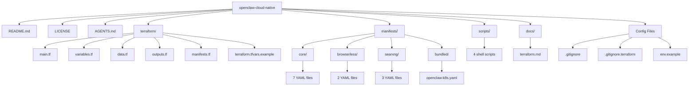

# Project Reorganization Plan

## Executive Summary

This plan reorganizes the OpenClaw Kubernetes deployment repository from a flat structure to a well-organized directory hierarchy. The reorganization improves maintainability while preserving backward compatibility for Terraform users.

## Current Structure Analysis

### Current Files (24 files at root)

```
openclaw-cloud-native/
├── .gitignore
├── .gitignore.terraform
├── AGENTS.md
├── LICENSE
├── README.md
├── browserless-deployment.yaml
├── browserless-service.yaml
├── config-pvc.yaml
├── data.tf
├── env.example
├── gateway-deployment.yaml
├── gateway-service.yaml
├── generate-manifest.sh
├── main.tf
├── manifests.tf
├── namespace.yaml
├── onboarding-job.yaml
├── openclaw-k8s.yaml          # Generated - will be gitignored
├── outputs.tf
├── searxng-deployment.yaml
├── searxng-pvc.yaml
├── searxng-service.yaml
├── secrets.yaml
├── setup.sh
├── terraform-quickstart.sh
├── terraform.md
├── terraform.tfvars.example
├── tools.sh
├── variables.tf
└── workspace-pvc.yaml
```

### File Categories

| Category | Files | Count |
|----------|-------|-------|
| Terraform | main.tf, variables.tf, data.tf, outputs.tf, manifests.tf, terraform.tfvars.example | 6 |
| Kubernetes Core | namespace.yaml, secrets.yaml, config-pvc.yaml, workspace-pvc.yaml, gateway-deployment.yaml, gateway-service.yaml, onboarding-job.yaml | 7 |
| Kubernetes Browserless | browserless-deployment.yaml, browserless-service.yaml | 2 |
| Kubernetes SearXNG | searxng-deployment.yaml, searxng-service.yaml, searxng-pvc.yaml | 3 |
| Kubernetes Misc | openclaw-k8s.yaml (generated) | 1 |
| Scripts | setup.sh, tools.sh, generate-manifest.sh, terraform-quickstart.sh | 4 |
| Documentation | README.md, terraform.md, AGENTS.md, LICENSE | 4 |
| Config | env.example, .gitignore, .gitignore.terraform | 3 |

---

## Proposed Structure

```
openclaw-cloud-native/
├── README.md                        # Keep at root (project entry point)
├── LICENSE                          # Keep at root
├── AGENTS.md                        # Keep at root (agent instructions)
├── .gitignore                       # Keep at root
├── .gitignore.terraform             # Keep at root
├── env.example                      # Keep at root (configuration template)
│
├── terraform/                       # Terraform configuration
│   ├── main.tf                      # Provider configuration
│   ├── variables.tf                 # Input variables
│   ├── data.tf                      # Locals and data sources
│   ├── outputs.tf                   # Output values
│   ├── manifests.tf                 # Kubernetes manifest resources
│   └── terraform.tfvars.example     # Example variable values
│
├── manifests/                       # Kubernetes YAML manifests
│   ├── core/                        # Core OpenClaw components
│   │   ├── namespace.yaml
│   │   ├── secrets.yaml
│   │   ├── config-pvc.yaml
│   │   ├── workspace-pvc.yaml
│   │   ├── gateway-deployment.yaml
│   │   ├── gateway-service.yaml
│   │   └── onboarding-job.yaml
│   │
│   ├── browserless/                 # Browserless browser automation
│   │   ├── deployment.yaml
│   │   └── service.yaml
│   │
│   ├── searxng/                     # SearXNG search engine
│   │   ├── deployment.yaml
│   │   ├── service.yaml
│   │   └── pvc.yaml
│   │
│   └── bundled/                     # Generated bundled manifests
│       └── openclaw-k8s.yaml
│
├── scripts/                         # Shell scripts
│   ├── setup.sh                     # Interactive setup script
│   ├── tools.sh                     # Operational tools
│   ├── generate-manifest.sh         # Generate bundled manifest
│   └── terraform-quickstart.sh      # Terraform quick start
│
└── docs/                            # Documentation
    └── terraform.md                 # Terraform usage guide
```

---

## Directory Structure Diagram



---

## Backward Compatibility Strategy

### Problem

The current Terraform configuration in [`data.tf`](data.tf:3) reads YAML files using relative paths:

```hcl
locals {
  namespace_yaml              = file("${path.module}/namespace.yaml")
  gateway_deployment_yaml     = file("${path.module}/gateway-deployment.yaml")
  # ... etc
}
```

After reorganization, these paths will break.

### Solution: Update Terraform Paths

Update all `file()` calls in [`data.tf`](data.tf) to reference the new manifest locations:

```hcl
locals {
  namespace_yaml              = file("${path.module}/../manifests/core/namespace.yaml")
  gateway_deployment_yaml     = file("${path.module}/../manifests/core/gateway-deployment.yaml")
  browserless_deployment_yaml = file("${path.module}/../manifests/browserless/deployment.yaml")
  searxng_deployment_yaml     = file("${path.module}/../manifests/searxng/deployment.yaml")
  # ... etc
}
```

### Alternative: Symlinks (Not Recommended)

Creating symlinks at root level would work but adds maintenance burden and may cause issues across different operating systems.

---

## Implementation Steps

### Phase 1: Create Directory Structure

1. Create `terraform/` directory
2. Create `manifests/core/`, `manifests/browserless/`, `manifests/searxng/`, `manifests/bundled/` directories
3. Create `scripts/` directory
4. Create `docs/` directory

### Phase 2: Move Terraform Files

| Source | Destination |
|--------|-------------|
| main.tf | terraform/main.tf |
| variables.tf | terraform/variables.tf |
| data.tf | terraform/data.tf |
| outputs.tf | terraform/outputs.tf |
| manifests.tf | terraform/manifests.tf |
| terraform.tfvars.example | terraform/terraform.tfvars.example |

### Phase 3: Move Kubernetes Manifests

| Source | Destination |
|--------|-------------|
| namespace.yaml | manifests/core/namespace.yaml |
| secrets.yaml | manifests/core/secrets.yaml |
| config-pvc.yaml | manifests/core/config-pvc.yaml |
| workspace-pvc.yaml | manifests/core/workspace-pvc.yaml |
| gateway-deployment.yaml | manifests/core/gateway-deployment.yaml |
| gateway-service.yaml | manifests/core/gateway-service.yaml |
| onboarding-job.yaml | manifests/core/onboarding-job.yaml |
| browserless-deployment.yaml | manifests/browserless/deployment.yaml |
| browserless-service.yaml | manifests/browserless/service.yaml |
| searxng-deployment.yaml | manifests/searxng/deployment.yaml |
| searxng-service.yaml | manifests/searxng/service.yaml |
| searxng-pvc.yaml | manifests/searxng/pvc.yaml |
| openclaw-k8s.yaml | manifests/bundled/openclaw-k8s.yaml (gitignored) |

### Phase 4: Move Scripts

| Source | Destination |
|--------|-------------|
| setup.sh | scripts/setup.sh |
| tools.sh | scripts/tools.sh |
| generate-manifest.sh | scripts/generate-manifest.sh |
| terraform-quickstart.sh | scripts/terraform-quickstart.sh |

### Phase 5: Move Documentation

| Source | Destination |
|--------|-------------|
| terraform.md | docs/terraform.md |

### Phase 6: Update Path References

#### 6.1 Update Terraform data.tf

Update all `file()` path references to use new manifest locations.

#### 6.2 Update Shell Scripts

Update the following scripts to reference new paths:

- [`setup.sh`](setup.sh:90) - Update YAML file references
- [`tools.sh`](tools.sh:57) - Update YAML file references  
- [`generate-manifest.sh`](generate-manifest.sh:4) - Update output path and references

#### 6.3 Update Documentation

- Update [`README.md`](README.md) with new file paths
- Update [`docs/terraform.md`](terraform.md) with new paths
- Update [`AGENTS.md`](AGENTS.md) with new paths and commands

### Phase 7: Update AGENTS.md

Update the agent instructions file to reflect new paths:

- Build/lint/test commands
- File references
- Deployment order instructions

---

## File Move Summary

### Files Staying at Root

| File | Reason |
|------|--------|
| README.md | Project entry point |
| LICENSE | Standard location |
| AGENTS.md | Agent instructions, should be at root |
| .gitignore | Standard location |
| .gitignore.terraform | Terraform-specific gitignore |
| env.example | Configuration template, easily discoverable at root |

### Files Moving to terraform/

| File | Lines | Purpose |
|------|-------|---------|
| main.tf | 19 | Provider configuration |
| variables.tf | 236 | Input variable definitions |
| data.tf | 537 | Locals and YAML file reading |
| outputs.tf | 88 | Output definitions |
| manifests.tf | 150 | Kubernetes manifest resources |
| terraform.tfvars.example | ~20 | Example variable values |

### Files Moving to manifests/core/

| File | Purpose |
|------|---------|
| namespace.yaml | Kubernetes namespace |
| secrets.yaml | Secret templates |
| config-pvc.yaml | Config PVC |
| workspace-pvc.yaml | Workspace PVC |
| gateway-deployment.yaml | Gateway deployment |
| gateway-service.yaml | Gateway service |
| onboarding-job.yaml | Onboarding job |

### Files Moving to manifests/browserless/

| File | Purpose |
|------|---------|
| deployment.yaml | Browserless deployment |
| service.yaml | Browserless service |

### Files Moving to manifests/searxng/

| File | Purpose |
|------|---------|
| deployment.yaml | SearXNG deployment |
| service.yaml | SearXNG service |
| pvc.yaml | SearXNG PVCs |

### Files Moving to scripts/

| File | Lines | Purpose |
|------|-------|---------|
| setup.sh | 226 | Interactive setup |
| tools.sh | 247 | Operational tools |
| generate-manifest.sh | 211 | Manifest generation |
| terraform-quickstart.sh | ~50 | Quick start helper |

### Files Moving to docs/

| File | Purpose |
|------|---------|
| terraform.md | Terraform documentation |

---

## Benefits of Reorganization

1. **Improved Discoverability**: Clear separation of concerns makes it easy to find files
2. **Better Maintainability**: Related files are grouped together
3. **Scalability**: Easy to add new components (e.g., `manifests/redis/`)
4. **Clearer Documentation Structure**: Docs have their own directory
5. **Professional Appearance**: Follows standard infrastructure-as-code project conventions

---

## Risks and Mitigations

| Risk | Mitigation |
|------|------------|
| Breaking existing workflows | Update all path references in Terraform and scripts |
| Users unfamiliar with new structure | Update README.md with directory overview |
| CI/CD pipelines break | Update any hardcoded paths in pipelines |
| IDE/editor bookmarks break | Communicate changes to team before reorganization |

---

## Validation Checklist

After reorganization, verify:

- [x] `terraform init` succeeds from `terraform/` directory
- [x] `terraform plan` shows no unexpected changes
- [x] `kubectl apply -f manifests/core/` works
- [x] `./scripts/setup.sh` runs correctly
- [x] `./scripts/tools.sh status` shows correct status
- [x] All documentation paths are correct
- [x] AGENTS.md commands work correctly
- [x] `migrate-state` target added to Makefile
- [x] Git tag `v0.1` created for pre-reorganization baseline

---

## Questions for Review

**Decisions Made:**
- ✅ `cli-job.yaml` will be removed (not needed)
- ✅ Add a `Makefile` at root for convenient entry points
- ✅ `openclaw-k8s.yaml` will be gitignored (generated file)

---

## Makefile Design

A `Makefile` will be added at the root to provide convenient entry points for common operations:

```makefile
.PHONY: help init plan apply destroy setup status logs clean

# Default target
help:
	@echo "OpenClaw Kubernetes Deployment"
	@echo ""
	@echo "Usage: make [target]"
	@echo ""
	@echo "Targets:"
	@echo "  init      Initialize Terraform"
	@echo "  plan      Preview Terraform changes"
	@echo "  apply     Deploy with Terraform"
	@echo "  destroy   Destroy all resources"
	@echo "  setup     Run interactive setup script"
	@echo "  status    Show deployment status"
	@echo "  logs      Follow gateway logs"
	@echo "  clean     Remove generated files"

# Terraform commands (run from terraform/ directory)
init:
	cd terraform && terraform init

plan:
	cd terraform && terraform plan

apply:
	cd terraform && terraform apply

destroy:
	cd terraform && terraform destroy

# Script wrappers
setup:
	./scripts/setup.sh

status:
	./scripts/tools.sh status

logs:
	./scripts/tools.sh logs

clean:
	rm -f manifests/bundled/openclaw-k8s.yaml
```

---

## .gitignore Updates

Add the following entry to `.gitignore`:

```gitignore
# Generated files
manifests/bundled/openclaw-k8s.yaml
```
